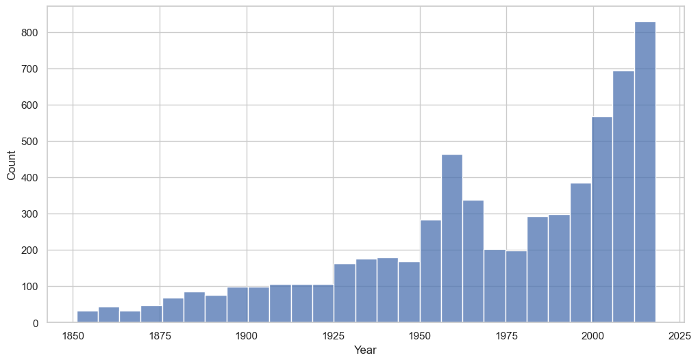
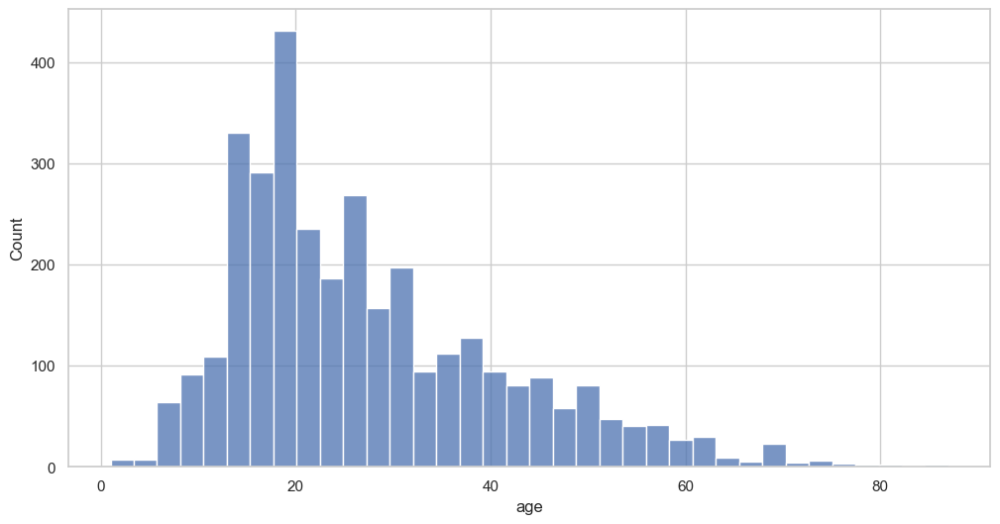
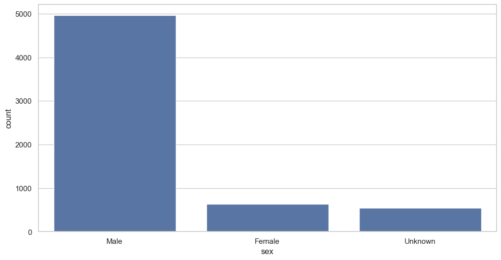
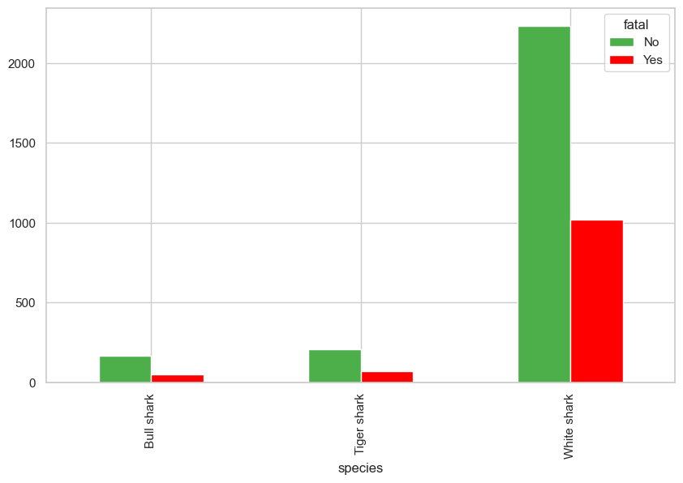
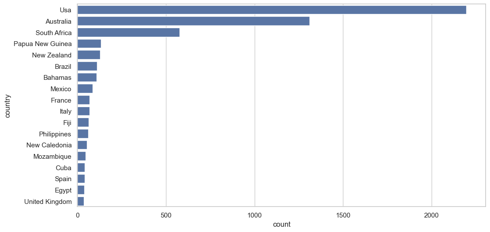
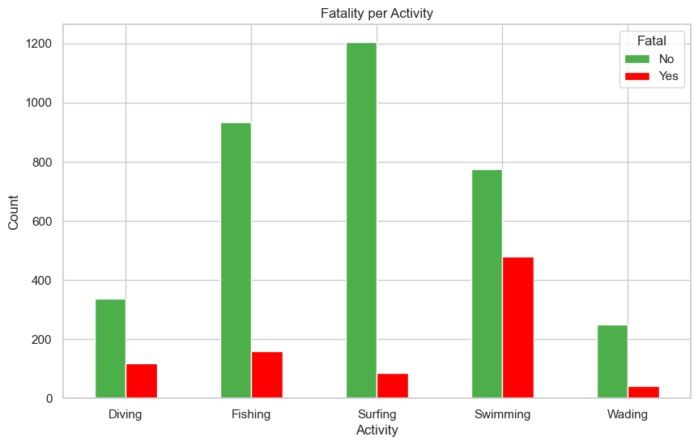
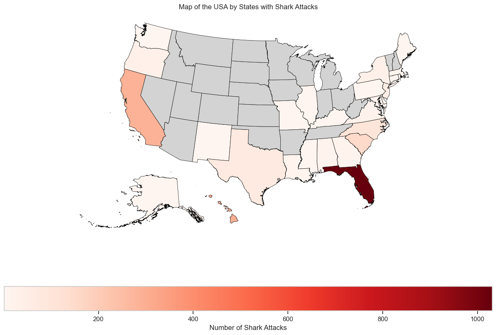
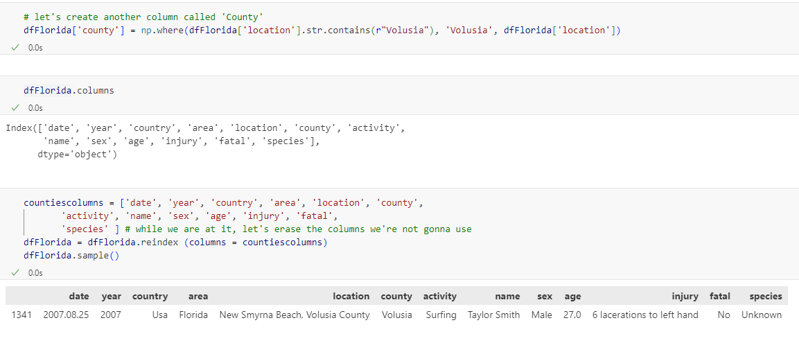
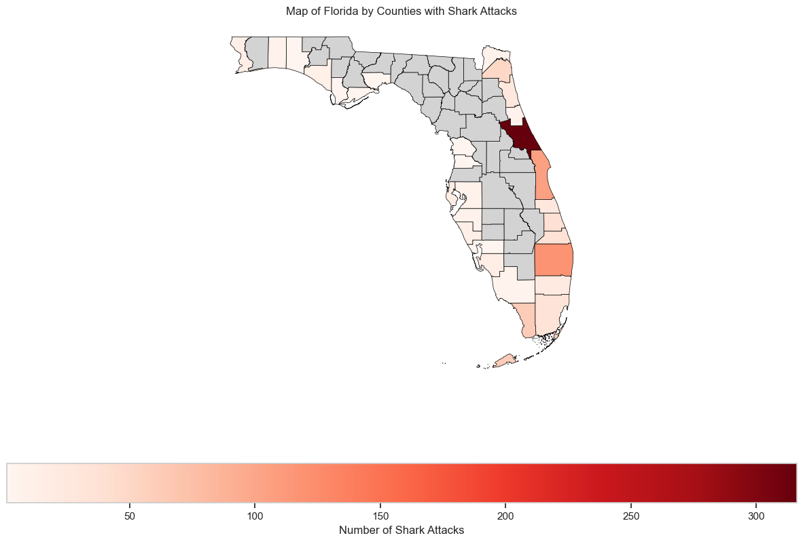

# Shark Attacks
We are going to analyze a dataframe with data of all the shark attacks registered worldwide until the 25th of June, 2018. 

## Hypothesis
Taking a first glance at the dataset, we can see the info that contains: date, location, name, gender, time of the attack, shark species, fatality, activity that was doing the person when they were attacked...

 
I decide to analyze some of them:
- Which are the most common activities? And the most dangerous?
- Is there any relation between the type and the fatality?
- Are all species equally fatal? If not, which is the most dangerous species?
- Fatality per geograpihcal areas, in the US for instance (Florida is the most interesting state since it's the one where there have been more attacks), and/or fatality per states/counties in the most attacked countries.

## General cleaning
First we'll clean as much as possible the raw dataframe. We drop the columns that give us not useful information and the rows with null values (where the whole row has null values, not just one null value in the row).

Columns deleted: Unnamed 22, Unnamed 23, original order, Case Number.1, Case Number.2, href, href formula, pdf

## 'Year' cleaning

I have detected 125 rows where 'Year' = 0, but there is info of the approximate year in 'Date', so I decide to change the values of 'Year' with this info, even if it's not 100% accurate. I started with the method .at using the row indexes, but decided to change to .loc so I could apply a condition. 

We will work with this data, from 1850, when I noticed an increase of the cases, before that the cases were sporadic with not much details.

After that, I delete 'Date' and rename 'Case Number' to 'Date'.

I convert the column names into lowercase.

## 'Age' cleaning

The first real clean is in the 'age' column.
We observe that there are 106 null values, and it's an object, not an int or a float.
So I get rid of the null values, I apply regex to select the odd values (Teens, 60s, etc) and change them for the mean (27.37).
Again, it's an approximate method, since the age won't coincide in most of these cases.

I changed the type into float, so that I can easily drop these values later, in comparison with normal ages (27.00), when I want to create visualizations based on the age. If I didn't do that later, I would have an unrealistic peak where age = mean, when we know it's not true because we have manually converted all these values.

dfage = dfclean[dfclean['age']!= 27.37]

dfclean (6142 rows): the full dataset with the nulls and odd values converted to the mean, which doesn't give us a correct age histogram. However, it's the df that we are going to work with, since it preserves all the useful rows (where we don't want to work with the age).

dfage (3352 rows): with the rows where originally Year = normal number, neither nulls and odd values converted to the mean, which gives us a correct age histogram.

## Gender cleaning

Luckily, this cleaning is much easier. We basically want three genders for now: male, female and unknown.

We will probably drop the unknown gender later.

I analyze the odd genders (N, lli, etc) and change them.

**Percentages**

Male: 81%

Female: 10%

Unknown: 9%

## Fatality cleaning

This cleaning is also quite simple, I just change the name of the column and change the odd values.

**Percentages**

Non fatal: 69%

Fatal: 21%

Unknown: 10%

## 'Type' cleaning

This cleaning is also quite simple, I just have to change the odd values, and then get rid of the 'Unknown' values so that they don't appear in the graphs, since they don't give us meaningful information.

I then create a barplot dropping the 'Unprovoked' values, since there are way more cases than the other types.

The barplot tells us that in **sea disasters** people are more likely to die, probably because they are far away from the coast, so they cannot receive medical assistance quick.

## 'Species' cleaning

As usual, I take a look at the species.value_counts() and group the same species together using regex, for diferent spelling (lowercase vs uppercase) or different names (Zambezi shark = Bull shark).

I quickly observe the attacks were done mostly by 3 species, in the following order: **White shark, Tiger shark and Bull shark**. Analyzing the fatality, we can see they are really similar, although the Tiger shark is slightly more fatal than the other two.

## 'Country' cleaning

This cleaning requires more work than the previous one. Taking a general look I see places that are not countries, so I change them.

This leaves me with 186 unique countries, way too many. So I decide to keep only the ones with a count >= 5, and change the rest to 'Other'.
I have to repeat this process until I am left with the 20 countries with most attacks, and change as well 'Unknown' to 'Other'.

Like we did before in 'age', I don't want to delete the 973 rows where country = 'Other', so I keep them in **dfclean**.

Then I make a subset called **dfcountries** without these rows, so we end up with 5169 rows to analyze statistics of countries. 
The countplot so far looks like this:

## 'Activity' cleaning

This cleaning also requires quite a lot of changes.

I basically group activities that are spelled differently (surfing / Surfing) and activities that are really similar (Bathing and Swimming, Fishing and Spearfishing, etc.).

In order to do that, I apply regex.

I keep the 5 most common activities, and analyze the fatality depending on the activity, creating a subset where I don't take the 'Unknown' values.

I also calculate the fatality percentages to see it much clearer.

We can observe there's a higher ratio of fatality amongst people who were **swimming** or diving, compared to the ones who were surfing or fishing.

# Analysis per geographical areas

Earlier we saw that most of the attacks happened in 3 countries: **US, Australia and South Africa**.

Let's first study the attacks in the US, the one with the most attacks.

## Analysis per US states

Taking a quick look, we see that have happened mainly in Florida, and then Hawaii, California and South and North Carolina. 

Let's visualize it.

## Analysis per Florida counties

The difference is so big that it could be interesting to study where in Florida there have been more attacks.

So what I do is basically create another column called 'county', where I will store the county based on the information I got from 'location'. I apply Regex to do so, and I use a map of the counties of Florida to go in order.

We can see that most of the attacks have happened in the **East Coast**, in the Atlantic Ocean, in **Volusia County**, and especially in one beach, **New Smyrna Beach**. To be avoided!

.png)

# Conclusions

After all the analysis we've reached a few conclusions:
- The most attacked collective is the surfers, though the swimmers are more likely to die
- The USA, Australia and South Africa are the countries with the most registered attacks, and inside the US, the East Coast of Florida.
- Youngsters are more likely to be attacked, also because they go into the water more than older people. 
- The three species that attack the most are the White Shark, the Tiger shark and the Bull shark. 
- There has been a progressively increase of registered shark attacks in the last years, but it's also due to the fact that people go more to the beach. 